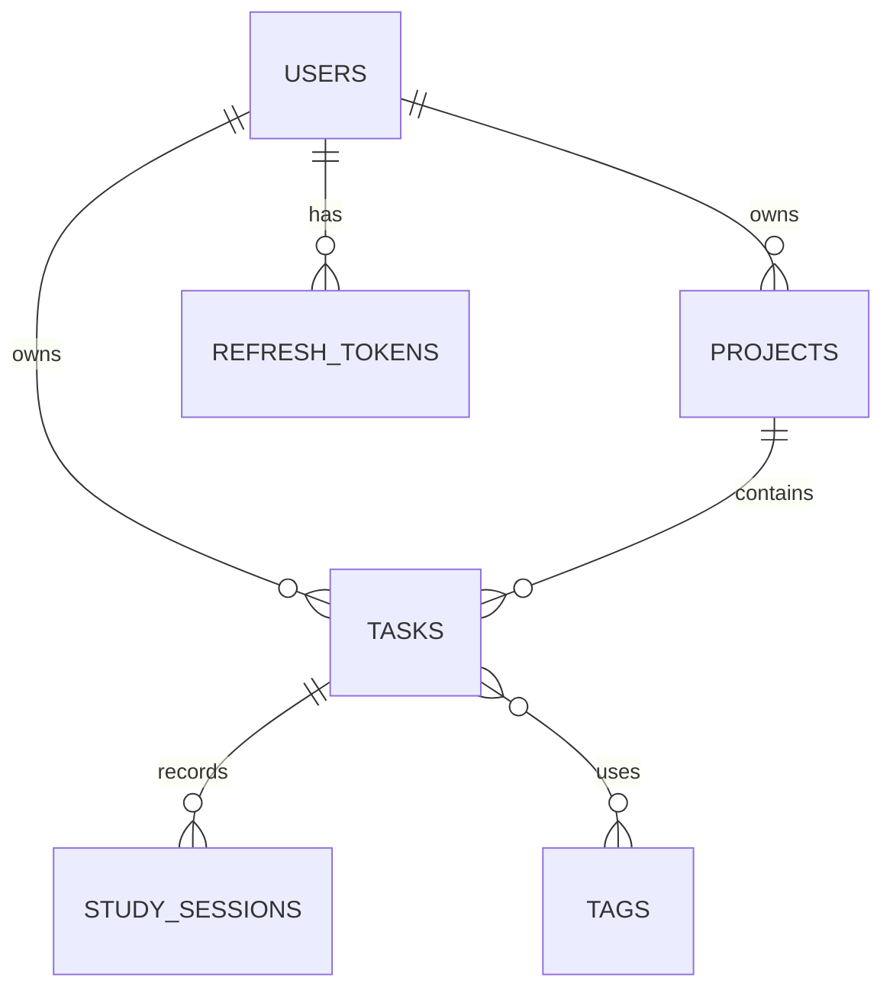

# FastAPI 学习任务管理系统：Codex 项目执行说明

> 用途：将本文件放在项目仓库根目录，并把“第 0 阶段启动指令”发送给 Codex。Codex 必须按阶段工作，每完成一个阶段后停止，等待用户确认，不得一次性生成整个系统。

## 1. 项目目标

开发一个可运行、可测试、可部署，并适合求职展示的学习任务管理后端。系统帮助用户管理学习项目、学习任务、实际学习记录和统计数据。

本项目同时承担学习目的。Codex 不只是生成代码，还必须解释实际代码的调用链、关键设计与测试依据，确保项目所有者能够逐步理解并独立修改。

### 成功标准

- 功能形成完整闭环：认证、数据隔离、项目、任务、学习记录、统计。
- 采用模块化单体架构，不使用微服务。
- 核心业务规则有自动化测试证明。
- 能通过 Docker Compose 在本地启动。
- 有清晰的 README、API 文档、数据库迁移和 CI。
- 项目所有者能说明请求如何从 Router 流向数据库并返回响应。

## 2. 需求审查结论

原始设想总体正确，但必须按以下结论收敛：

1. **MVP 范围需要缩小。** 管理员、Redis、提醒、后台任务、重复任务、审计日志和 AI 推荐均不进入 MVP。
2. **先同步后异步。** 使用 SQLAlchemy 2 同步 Session。首个完整项目不因追求“异步”增加事务和调试难度。
3. **退出登录必须有准确语义。** Access Token 保持短有效期；Refresh Token 在服务端仅保存哈希，并支持轮换、吊销和退出。退出后，已经签发的 Access Token 可能在短有效期内继续有效，除非未来增加 denylist。
4. **项目删除不是“后端二次确认”。** MVP 中项目有任务时返回 `409 PROJECT_NOT_EMPTY`；用户应先处理任务或归档项目。前端是否弹出确认框不属于后端核心需求。
5. **避免重复维护学习时长。** 引入学习记录后，任务实际时长由所属学习记录汇总得出，不再让客户端直接写入一个容易失真的 `actual_minutes` 字段。
6. **截止时间规则需要合理。** 不强制“截止时间晚于创建时间”，因为可能录入已逾期任务；若同时提供计划日期，则截止时间不得早于计划日期。
7. **软删除暂缓。** MVP 使用项目归档；任务删除采用硬删除。软删除会影响所有查询、唯一约束和统计，应在确有恢复需求时再加入。
8. **测试数据库应接近生产环境。** 生产使用 PostgreSQL，集成测试也优先使用独立 PostgreSQL 测试库，不用 SQLite 假装完全等价。
9. **分层应服务于清晰度。** Router / Service / Repository / Schema / Model 分层保留，但不为简单操作制造无意义抽象。
10. **“工业级”不等于堆技术。** 优先保证权限、事务、迁移、测试、日志、配置和部署正确。

## 3. 固定技术方案

- Python：使用当前受支持的稳定版本，并在 `pyproject.toml` 中固定最低版本。
- FastAPI：HTTP API 与 OpenAPI。
- Pydantic 2 + pydantic-settings：校验与配置。
- SQLAlchemy 2：同步 ORM 与事务。
- PostgreSQL：开发、测试和正式数据库。
- Alembic：数据库迁移。
- JWT：短期 Access Token。
- Refresh Token：随机高熵令牌，数据库仅保存哈希，支持轮换和吊销。
- Argon2id：密码哈希；如所选维护良好的库不支持，再说明理由后使用 bcrypt。
- pytest：单元测试与 API 集成测试。
- Ruff：格式化与静态检查。
- mypy 或 pyright：二选一，在初始化时说明选择理由。
- Docker Compose：应用与 PostgreSQL 本地编排。
- GitHub Actions：持续集成。

初始化时选择相互兼容的稳定版本并锁定依赖。除非当前阶段确有需要，不得增加 Redis、Celery、消息队列或其他基础设施。

## 4. 架构边界

```text
app/
├── api/
│   ├── dependencies.py
│   └── v1/
│       ├── router.py
│       └── endpoints/
├── core/
│   ├── config.py
│   ├── exceptions.py
│   ├── logging.py
│   └── security.py
├── db/
│   ├── base.py
│   └── session.py
├── models/
├── repositories/
├── schemas/
├── services/
└── main.py

tests/
├── unit/
├── integration/
└── conftest.py
```

职责：

- Router：HTTP 参数、依赖注入、状态码和响应模型。
- Schema：请求与响应的数据校验，不等同于数据库表。
- Service：业务规则、授权编排和事务边界。
- Repository：数据库查询与持久化，不包含 HTTP 逻辑。
- Model：数据库映射与约束。
- Core：配置、安全、日志和统一异常。

简单逻辑不必强行拆出过多类，但 Router 不得直接堆积数据库业务逻辑。

## 5. 产品范围

### 5.1 MVP 必须实现

#### 用户与认证

- 邮箱 + 密码注册。
- 登录并签发 Access Token 与 Refresh Token。
- Refresh Token 轮换。
- 退出并吊销对应 Refresh Token。
- 获取和修改当前用户公开资料。
- 修改密码，并吊销该用户现有 Refresh Token。
- 密码哈希存储；响应、日志和仓库不得出现密码、密码哈希、完整 Token 或密钥。
- 邮箱唯一，统一规范化后再比较。

MVP 暂不做：邮箱验证、第三方登录、找回密码、账户注销和管理员。

#### 学习项目

- 创建、查看、分页列表、修改、归档项目。
- 项目字段：`id`、`user_id`、`name`、`description`、`start_date`、`target_date`、`status`、`created_at`、`updated_at`。
- 状态：`NOT_STARTED`、`IN_PROGRESS`、`COMPLETED`、`ARCHIVED`。
- `target_date` 不得早于 `start_date`。
- 用户只能访问自己的项目。
- 项目含有关联任务时禁止硬删除并返回 409；MVP 的主要移除方式为归档。

#### 学习任务

- 创建、详情、分页列表、修改和删除。
- 字段：`id`、`user_id`、`project_id`、`title`、`description`、`status`、`priority`、`planned_date`、`due_at`、`estimated_minutes`、`completed_at`、`created_at`、`updated_at`。
- 状态：`TODO`、`IN_PROGRESS`、`COMPLETED`、`CANCELLED`。
- 优先级：`LOW`、`MEDIUM`、`HIGH`、`URGENT`。
- 完成时由服务端填写 `completed_at`；从完成状态恢复时清空它。
- 相同状态的重复更新必须幂等，不得重复累计任何数据。
- `estimated_minutes` 必须为正数并设置合理上限。
- 若同时存在 `planned_date` 和 `due_at`，`due_at` 不得早于该计划日期的起点。
- 所属项目必须归当前用户所有；任务的 `user_id` 与项目所有者必须一致。
- 列表支持 `page`、`page_size`，并按状态、优先级、项目、日期范围、是否逾期和标题关键词筛选。
- 排序字段采用白名单，防止任意字段排序；必须有确定性的次级排序。
- “逾期”定义：`due_at < 当前时间` 且状态不是 `COMPLETED` 或 `CANCELLED`。

#### 基础工程能力

- `/health/live` 存活检查。
- `/health/ready` 就绪检查，能验证数据库连接。
- Alembic 初始迁移。
- 统一错误格式。
- Request ID 与结构化日志。
- UTC、时区感知的时间戳。
- Docker Compose。
- pytest、Ruff、类型检查和 GitHub Actions。

### 5.2 第二版实现

#### 标签

- `tags` 与 `task_tags` 多对多关系。
- 标签属于用户，名称在同一用户范围内唯一。
- 不允许把其他用户的标签绑定到任务。

#### 学习记录

- 字段：`id`、`user_id`、`task_id`、`started_at`、`ended_at`、`duration_minutes`、`notes`、`focus_level`、`created_at`、`updated_at`。
- `ended_at` 必须晚于 `started_at`。
- 时长由服务端根据起止时间计算，客户端不能直接决定。
- 记录必须属于当前用户的任务。
- 第二版默认禁止同一用户的学习时间段重叠，并用测试覆盖边界；如改变该规则，必须先更新需求文档。
- 任务实际时长由学习记录聚合得到。

#### 统计

- 今日与本周学习时长。
- 指定日期范围内的每日趋势。
- 任务完成率。
- 逾期任务数量。
- 按项目统计学习时长。
- 连续学习天数。
- 所有统计由后端计算，明确时区边界，并限制最大查询范围。

### 5.3 后续可选功能

- 管理员与封禁。
- 账户注销与数据保留策略。
- 邮箱验证和找回密码。
- 重复任务、提醒和后台任务。
- Redis 缓存或限流。
- 审计日志。
- 正式云部署、监控与备份。
- AI 学习建议。

只有前一阶段稳定、测试通过且项目所有者能够解释代码后，才能选择这些功能。

## 6. 数据模型初稿

核心表：

- `users`
- `projects`
- `tasks`
- `refresh_tokens`
- 第二版：`tags`、`task_tags`、`study_sessions`

关系：



所有表使用数据库生成的稳定主键；选择 UUID 或整数主键前，Codex 必须简要说明取舍并保持全项目一致。高频筛选与外键字段建立必要索引，唯一性和跨字段不变量尽量由数据库约束与服务层共同保护。

## 7. API 约定

版本前缀：`/api/v1`。

主要路由：

```text
POST   /api/v1/auth/register
POST   /api/v1/auth/login
POST   /api/v1/auth/refresh
POST   /api/v1/auth/logout
GET    /api/v1/users/me
PATCH  /api/v1/users/me
POST   /api/v1/users/me/change-password

POST   /api/v1/projects
GET    /api/v1/projects
GET    /api/v1/projects/{project_id}
PATCH  /api/v1/projects/{project_id}
POST   /api/v1/projects/{project_id}/archive
DELETE /api/v1/projects/{project_id}

POST   /api/v1/tasks
GET    /api/v1/tasks
GET    /api/v1/tasks/{task_id}
PATCH  /api/v1/tasks/{task_id}
DELETE /api/v1/tasks/{task_id}
POST   /api/v1/tasks/{task_id}/complete
```

要求：

- 创建、更新、内部和响应 Schema 分离。
- 使用正确的 HTTP 状态码：创建 201、成功无响应体删除 204、认证失败 401、无权限 403、资源不存在 404、业务冲突 409、校验失败 422。
- 为减少资源枚举风险，访问其他用户资源时通常返回 404；在文档中保持一致。
- 分页响应必须包含 `items`、`page`、`page_size`、`total`、`pages`。
- OpenAPI 中不得暴露内部字段。
- 所有公开时间均为包含时区偏移的 ISO 8601 字符串，数据库统一保存 UTC。
- PATCH 必须正确区分“字段未提供”和“字段明确设为 null”。

统一业务错误示例：

```json
{
  "error": {
    "code": "TASK_NOT_FOUND",
    "message": "Task does not exist",
    "details": null
  },
  "request_id": "01H..."
}
```

Pydantic 默认校验错误可以通过全局异常处理器转换为同一外层结构，但不得丢失有用的字段错误信息。

## 8. 安全与可靠性规则

- 每个用户资源查询必须包含当前用户所有权条件，不能只验证 Token。
- 禁止客户端提交或覆盖资源的 `user_id`。
- 不把认证失败原因细分到足以枚举账户；登录统一使用通用错误信息。
- Access Token 必须包含最少必要声明，并验证签名、过期时间、签发者与受众（若项目配置这些声明）。
- Refresh Token 只能保存哈希；轮换时旧令牌立即失效。
- 密钥和数据库口令仅来自环境变量；提交 `.env.example`，不得提交真实 `.env`。
- CORS 使用明确白名单，不得在携带凭据时使用任意来源。
- 数据库写操作要有明确事务边界，异常时回滚。
- Repository 查询避免 N+1；列表必须分页。
- 用户可控字符串设置长度上限；分页大小和统计日期范围设置上限。
- 日志记录请求方法、路径模板、状态码、耗时和 Request ID，但不记录密码、完整 Token、Authorization Header 或敏感请求体。
- 不自行编写密码算法或 JWT 加密实现，使用维护良好的库。
- 正式环境的 API 文档是否公开必须可配置。

## 9. 测试与质量门槛

每个功能同时包含成功路径、失败路径、边界条件和权限隔离测试。

最低测试场景：

- 注册成功、重复邮箱、非法邮箱、弱密码。
- 登录成功、错误凭据、失效 Access Token。
- Refresh Token 轮换、重复使用旧 Refresh Token、退出后刷新失败。
- 用户 A 无法读取、修改或删除用户 B 的项目、任务和学习记录。
- 项目日期约束、归档行为和非空项目删除冲突。
- 任务 CRUD、筛选、分页、稳定排序和非法状态输入。
- 完成任务填写时间，恢复任务清空时间，重复完成保持幂等。
- 数据库写入异常能正确回滚。
- 第二版：学习时长计算、跨午夜/时区边界、重叠记录拒绝和统计正确性。

每阶段完成前运行并报告真实结果：

```text
pytest
ruff check .
ruff format --check .
<选定的类型检查命令>
```

如果因为环境原因无法运行，必须准确说明未验证内容和复现命令，不得声称“应该可以”。核心模块以约 80% 覆盖率为方向，但测试价值高于覆盖率数字。

## 10. 分阶段执行计划

### 阶段 0：需求与仓库基线（只规划，不写业务代码）

产出：

- 检查仓库、运行环境和现有文件。
- 记录必须由用户决定的问题；其余使用本文件默认值。
- 创建或完善 `AGENTS.md`、`docs/requirements.md`、`docs/architecture.md` 和 `docs/roadmap.md`。
- 将工作拆成每项约 1～2 小时的小任务，每项有验收标准。

验收：文档之间没有冲突，MVP 范围明确，不生成业务模块。

### 阶段 1：可启动骨架

产出：FastAPI 应用、配置、健康检查、pytest、Ruff、类型检查、README 基础说明。

验收：应用可启动，存活检查返回 200，测试和质量检查通过。

学习重点：Python 包、应用工厂或应用实例、路由、依赖、Pydantic、pytest。

### 阶段 2：PostgreSQL 与迁移

产出：数据库 Session、Base、Docker Compose PostgreSQL、Alembic、测试数据库策略。

验收：迁移可从空数据库升级到最新并降级一次；就绪检查能反映数据库状态；集成测试连接独立测试库。

学习重点：表、主外键、事务、Session、迁移。

### 阶段 3：用户注册

产出：用户模型、迁移、注册 Service/Repository/Router、密码哈希和测试。

验收：注册 201、重复邮箱 409、非法输入 422、响应不泄露敏感字段。

### 阶段 4：登录与当前用户

产出：登录、Access Token、获取当前用户和认证依赖。

验收：有效登录成功；错误、过期或篡改 Token 被拒绝；受保护接口可识别当前用户。

### 阶段 5：Refresh Token 与密码修改

产出：刷新、轮换、吊销、退出和修改密码。

验收：旧刷新令牌不可重用；退出后不能刷新；修改密码后既有刷新令牌失效。

### 阶段 6：项目管理

建议顺序：创建 → 详情 → 列表分页 → 修改 → 归档 → 删除约束。每次只实现一个小功能。

验收：日期规则、权限隔离、分页、归档和删除冲突均有测试。

### 阶段 7：任务管理

建议顺序：创建 → 详情 → 列表分页 → 筛选排序 → 修改 → 状态动作 → 删除。

验收：所有权、项目归属、日期、状态时间戳、幂等、筛选和分页均有测试。

### 阶段 8：工程化收尾

产出：统一错误、Request ID、结构化日志、Docker Compose 应用服务、CI、完整 README 和 API 示例。

验收：从全新环境按 README 可启动；CI 执行测试、格式、静态检查和类型检查；仓库不含密钥。

### 阶段 9：第二版功能

依次实现标签、学习记录、聚合实际时长和统计。每个模块仍按“一个小功能一次”的原则推进。

## 11. Codex 工作协议

Codex 每次收到任务后必须：

1. 先读取根目录 `AGENTS.md`、本文件、相关文档和现有代码。
2. 检查 Git 状态，保留用户已有修改，不覆盖或回退无关内容。
3. 用 3～7 条列出本次范围、涉及文件和验收方式。
4. 信息不足且会实质改变设计时才提问；能安全推断的内容采用本文件默认值并声明。
5. 一次只完成一个明确的小任务，不提前实现后续阶段。
6. 修改后运行最小相关测试，再运行阶段要求的完整检查。
7. 审查差异，检查权限、事务、敏感信息、过度设计和无关改动。
8. 最终报告实际修改文件、真实测试结果、未解决问题、调用链和三个学习点。
9. 阶段结束后停止并等待用户确认，不自动进入下一阶段。

禁止行为：

- 一次生成整个项目。
- 未查看现有代码就假设文件不存在。
- 修改无关文件或进行未经要求的大规模重构。
- 未说明理由就增加生产依赖。
- 为了“工业级”提前加入微服务、Redis、Celery、Kubernetes 或复杂设计模式。
- 跳过测试却宣称任务完成。
- 自动执行 `git commit`、`git push`、删除数据库或其他破坏性操作，除非用户明确要求。

## 12. 每个小任务的标准提示模板

```text
目标：
<只写一个可在 1～2 小时完成的功能>

当前上下文：
- 先读取 AGENTS.md、CODEX_FASTAPI_LEARNING_TASK_SYSTEM.md 和相关现有代码。
- 当前所在阶段：<阶段编号与名称>。

功能要求：
1. <具体行为>
2. <业务规则>
3. <异常行为>

约束：
1. 保持现有分层和代码风格。
2. 不修改无关文件，不提前实现后续功能。
3. 用户资源必须校验所有权。
4. 数据库结构变化必须提供并检查 Alembic 迁移。
5. 不增加无必要依赖。

完成标准：
1. <接口与状态码>
2. <测试场景>
3. pytest、Ruff 和类型检查通过。
4. 最后解释实际调用链和三个学习点。

执行方式：
先检查并给出简短计划，然后实施。完成本任务后停止，不进入下一项。
```

## 13. 第 0 阶段启动指令（首次直接发送给 Codex）

```text
我要逐步开发一个用于学习和求职展示的 FastAPI 学习任务管理系统。

请先完整读取仓库根目录的 CODEX_FASTAPI_LEARNING_TASK_SYSTEM.md，并把它作为产品范围、架构约束和阶段路线的主要依据。

现在只执行“阶段 0：需求与仓库基线”，暂时不要创建业务代码、数据库模型或接口实现。

你的任务：
1. 检查当前目录、Git 状态、已有文件和可用运行环境。
2. 审查说明文档是否与仓库现状冲突。
3. 只有在答案会实质改变架构或 MVP 范围时，才向我提出最多 5 个必要问题；否则采用文档默认值并明确记录假设。
4. 创建或完善简洁的 AGENTS.md，使其包含运行命令、分层规则、安全约束、验证命令和“每阶段完成后停止”的规则。
5. 创建 docs/requirements.md、docs/architecture.md 和 docs/roadmap.md。
6. 把阶段 1 拆成若干个 1～2 小时内可完成的小任务，每项给出目标、涉及文件、学习点和验收标准。
7. 检查生成文档的一致性，但不要开始阶段 1。

完成后向我报告：
- 你检查了什么；
- 创建或修改了哪些文件；
- 采用了哪些默认决策；
- 仍需我决定什么；
- 建议我下一条发送给你的具体任务文本。
```

## 14. 每个功能完成后的学习复盘提示

```text
请基于刚才实际修改的代码进行教学复盘，不要继续修改代码：

1. 按 HTTP 请求 → Router → Schema → Service → Repository → SQLAlchemy → PostgreSQL → Response 解释完整调用链，并指出具体文件和函数。
2. 说明事务在何处开始、提交和回滚。
3. 说明用户所有权在哪里验证。
4. 选择三段最关键代码逐行解释。
5. 解释测试如何证明功能正确，以及还没覆盖什么。
6. 给我一个 15～30 分钟能独立完成的小修改，不要直接给完整答案。
```

## 15. 提交前审查提示

```text
请只审查当前未提交修改，暂时不要改代码，也不要执行 git commit：

1. 对照本次需求逐项判断是否满足。
2. 检查资源级权限、Token/密码泄露、输入边界、事务回滚和并发一致性。
3. 检查是否存在重复代码、N+1、过度设计或无关改动。
4. 检查测试是否遗漏失败路径、权限隔离和边界条件。
5. 按严重程度列出问题，并给出最小修复建议。
6. 如果没有阻塞问题，给出一个 Conventional Commits 风格的提交信息建议。
```

## 16. 项目所有者的学习检查表

每完成一个模块，项目所有者应能用自己的话回答：

1. 请求从哪个路由进入？
2. 输入在哪里被校验？
3. 业务规则在哪一层？
4. 数据库查询在哪里？
5. Session 何时提交和回滚？
6. 如何保证用户 A 看不到用户 B 的数据？
7. 失败时返回哪个状态码和错误码？
8. 哪些测试能证明它正确？
9. 如果增加一个字段，需要修改哪些层？
10. 这一设计有什么取舍，而不是只背代码？

若其中大部分无法回答，先执行“学习复盘提示”，不要继续增加功能。
