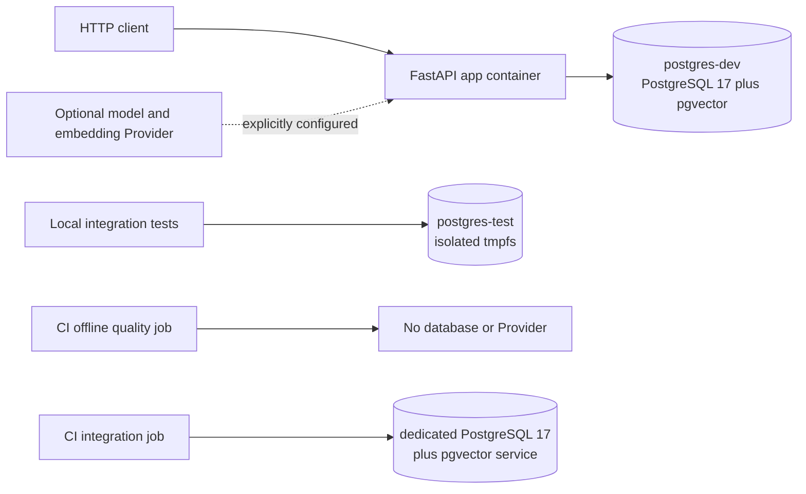
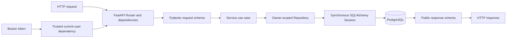
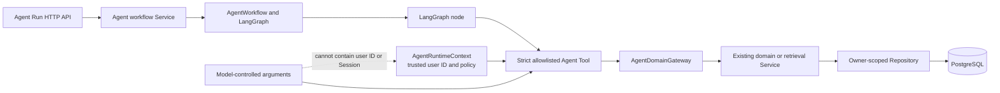
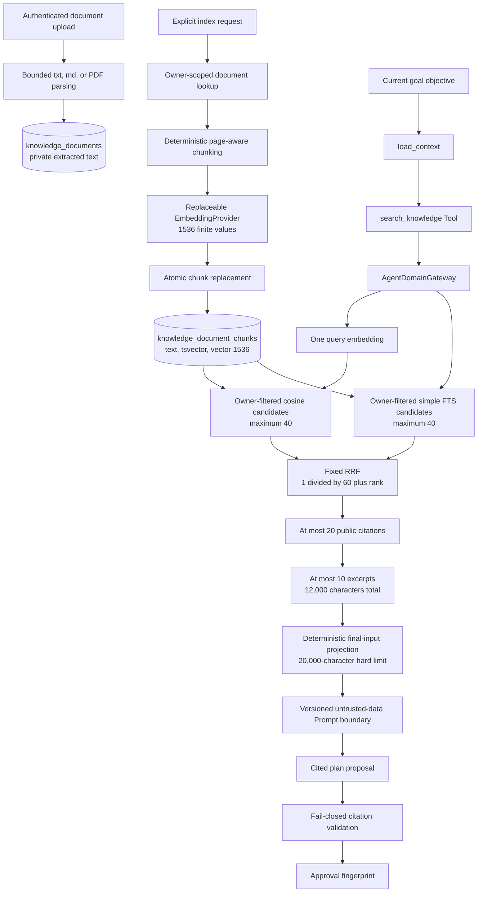
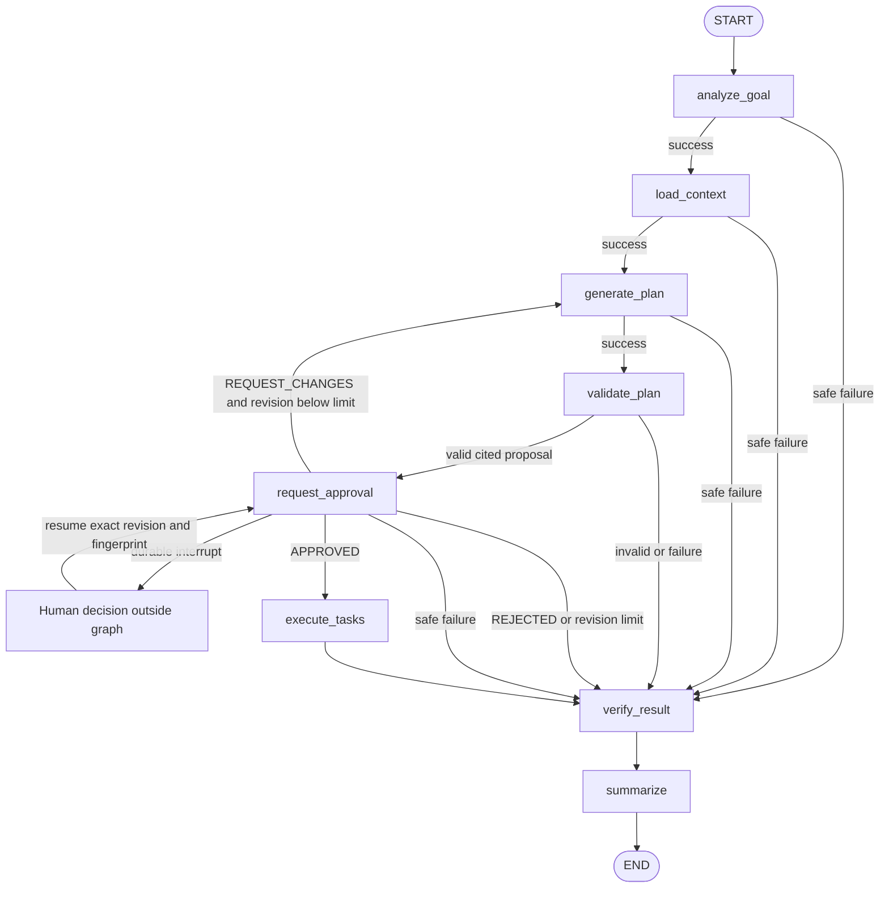
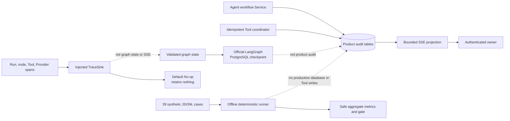

# Architecture

## System context

FastAPI STMS is a modular monolith: one FastAPI application contains the HTTP,
domain, Agent, retrieval, and evaluation modules. PostgreSQL 17 is the only
runtime database; pgvector supplies fixed-size vector storage and cosine search.
Docker Compose provides a persistent development database and a separately
isolated disposable test database.

The application currently exposes unversioned health probes and versioned auth,
user, Project, Task, Agent-run, and knowledge-document routes. There is no public
knowledge-search HTTP endpoint: retrieval is available only through the strict
`search_knowledge` Agent Tool.

### Deployment and execution boundaries



In local Compose, `app` waits for healthy `postgres-dev`, runs `alembic upgrade
head`, and then starts Uvicorn. `postgres-test` is not an `app` dependency and is
started only for explicitly selected integration tests. The two databases use
different services, users, databases, host ports, and storage. The development
service uses a named volume; the test service uses `tmpfs`.

Relevant files: `Dockerfile`, `compose.yaml`, `.github/workflows/ci.yml`,
`app/main.py`, and `app/db/session.py`.

Task 12.2's workflow is locally verified but not yet committed or pushed, so no
remote GitHub Actions run currently proves it. Ordinary tests and offline
evaluation do not contact PostgreSQL, a model Provider, or the network.

## Actual source layout

```text
app/
├── agent/          # graph, nodes, tools, providers, grounding, tracing, evals
├── api/            # health and /api/v1 router composition
├── core/           # settings, security primitives, tokens, safe exceptions
├── db/             # declarative Base, synchronous Session, readiness probe
├── models/         # SQLAlchemy mappings and database constraints
├── repositories/   # persistence queries over caller-supplied Sessions
├── schemas/        # strict request and public response contracts
├── services/       # use cases, authorization, transactions, Agent gateway
└── main.py         # application factory and validation-error masking

alembic/versions/   # one reversible migration chain
evals/stage11/      # versioned synthetic dataset, baseline, and instructions
tests/
├── fakes/          # deterministic model, embedding, evaluation, and trace fakes
├── integration/    # protected real-PostgreSQL behavior
├── external/       # explicit opt-in Provider smoke boundary
└── test_*.py       # ordinary offline unit and contract tests
```

This is the implemented layout, not a request to create future modules. Router
wiring is in `app/api/router.py` and `app/api/v1/router.py`.

## HTTP layering and transactions



Text alternative: a request is parsed and authenticated at the Router boundary,
validated by a strict Schema, processed by a Service, and persisted or queried by
a Repository using a supplied synchronous Session. The response is projected
through a public Schema before it leaves the application.

| Layer | Owns | Must not own |
| --- | --- | --- |
| Router/dependency | HTTP parsing, authentication dependency, status codes, response model | SQL queries or substantial business policy |
| Schema | Bounded input and explicit public output | Persistence and transaction behavior |
| Service | Use-case rules, owner orchestration, state transitions, commit/rollback | FastAPI response construction |
| Repository | SQLAlchemy statements, `add`, `delete`, and necessary `flush` | HTTP concepts, independent `commit` or `rollback` |
| Model | Table mapping, relationships, indexes, database constraints | Public serialization contracts |
| Core/DB | Settings, token/password primitives, Base, Engine, Session factory, readiness probe | Feature workflows |

`app/db/session.py::get_session` owns the request Session lifecycle. A write
Service commits a successful use case and rolls back failures. Repositories may
flush to obtain generated values but never commit. Read Services do not commit.

The Bearer dependency in `app/api/dependencies.py` validates the token and loads
the current user. Clients cannot submit resource `user_id` values. Services pass
the trusted UUID to Repository methods, and owned queries include it in their
predicates. Foreign-owned and missing resources share the documented safe 404
behavior. Composite database foreign keys additionally protect Project/Task,
Agent, and knowledge-document ownership.

The project does not currently implement general request-ID middleware,
structured request logging, CORS policy, or the previously planned common error
envelope. Implemented endpoints use their explicit response schemas and bounded
`detail` messages; login/refresh/logout/password-change validation errors use a bounded server-selected
field/message allowlist in `app/main.py`, while other routes retain password masking.

Task 5.4 adds JSON-body credential delivery, verified by real HTTP/PostgreSQL tests
and accepted by the owner. Login authenticates email/password and prepares a refresh digest;
refresh authenticates possession by locked digest lookup, then derives the owner
from that row, never from a client-selected UUID or an Access Token. Both use cases
prepare the access JWT and response before the single commit. The shared private
refresh preparation steps do not commit; the Task 5.2/5.3 standalone wrappers keep
their existing transaction contracts. The authentication route boundary suppresses
unsafe dependency/service diagnostics and sets no-store headers; it is not a global
error/logging framework. Responses explicitly deliver two credentials and the
refresh expiry, while repr hides credentials. Cookie delivery is not implemented.

Task 5.5 adds JSON-body logout with the same credential/error boundary. Its service
locks the presented digest, conditionally revokes that row using its stored owner,
and commits before an empty 204. Missing/already revoked credentials share 204;
expired credentials may be revoked too. No successor, other session or access JWT
is revoked. Logout and rotation serialize on the same row; refresh winning first
leaves a valid successor. Clients must serialize these actions and use the latest
refresh credential. Verification evidence lives in the Task 5.5 record.

Task 5.6 adds authenticated password change with current-password reauthentication.
One service transaction writes the Argon2id hash/updated_at and revokes every
unrevoked refresh credential for that owner before empty 204. Login now locks the
user before password verification; refresh/logout lock the user before their
credential row, and internal creation also locks its user. Consistent user-first
locking prevents in-flight old-password login or refresh from escaping revocation.
The password-change query refreshes stale identity-map state after acquiring its
lock. All changes roll back on pre-commit failure; existing access JWTs remain
valid until expiry. Hash work holds the user lock, so competing same-user requests
can reach the bounded lock timeout. No migration or new dependency is required.

Stage 5 acceptance evidence is consolidated in
[Task 5.7](tasks/stage-5-7-auth-security-acceptance.md). The additional PostgreSQL
suite covers the combined two-owner lifecycle, real lock-timeout recovery at all
four authentication write endpoints, and exceptions injected after real commits.
A safe 503 does not imply rollback: login can retain an undelivered credential,
refresh may already have consumed the old credential, and a new password may
already be effective. Logout can retry the same credential; refresh/password-change
recovery may require login with the applicable password. This is a documented
delivery boundary, not a distributed-transaction or exactly-once guarantee.

## Agent Tool and domain-service boundary



Text alternative: `app/api/v1/endpoints/agent_runs.py` delegates to
`app/services/agent_workflow.py`, which builds the graph in `app/agent/graph.py`.
Nodes call only the Tool executor in `app/agent/tools.py`. The Tool takes trusted
identity from `AgentRuntimeContext`, validates an exact allowlist and argument
schema, then calls `AgentDomainGateway` in `app/services/agent_domain.py`.

The gateway creates and always closes a short synchronous Session. Domain write
Services retain their own commit/rollback boundary; read Tools do not commit.
High-impact `batch_create_tasks` and `delete_task` execution additionally requires
the exact validated proposal, a matching persisted approval, and a unique
database execution claim managed by
`app/services/agent_tool_executions.py`.

## Knowledge ingestion, retrieval, and grounding



Text alternative: upload and indexing are separate. Upload never calls an
Embedding Provider. Explicit indexing in
`app/services/knowledge_document_indexing.py` creates deterministic chunks of at
most 2,000 characters with 200-character overlap, obtains validated 1536-value
embeddings, and atomically replaces at most 200 chunks.

During an Agent run, `app/agent/nodes/context.py::load_context` invokes the
existing `search_knowledge` Tool once using the current objective. The retrieval
Service in `app/services/knowledge_retrieval.py` generates one query embedding
and calls the two queries in
`app/repositories/knowledge_document_chunks.py`. Both SQL statements apply the
trusted chunk and document owner predicates, plus any document filter, before
their `ORDER BY` and `LIMIT 40`. User text is a bound parameter for
`plainto_tsquery('simple', query)`; it is not interpolated SQL or tsquery syntax.

`app/agent/retrieval.py` fuses the two ranked ID lists in code using the fixed
formula `sum(1 / (60 + rank))`, merges duplicate chunks, and breaks equal scores
by chunk UUID. The result exposes stable citation identity, bounded rank
evidence, and excerpts of at most 500 characters, never embeddings, tsvectors,
SQL, ORM objects, owner IDs, or complete documents.

`app/agent/grounding.py` keeps at most 10 citations in serializable graph state
and renders them inside the `knowledge-grounding.v1` untrusted-data boundary.
Angle brackets in source text are escaped, and the complete rendered grounding
block is capped at 12,000 characters. Retrieved instructions cannot change
identity, Tool allowlists, approval, system policy, or output schemas. Plan
citation IDs must come from the current context; missing, unknown, duplicate, or
excess references fail closed before the proposal can be approved.

Before the planning Provider call, `app/agent/prompt_budget.py` projects the
validated goal, required context, revision feedback, latest-first Project/Task
pages, and relevance-ranked grounding into one deterministic character budget.
Initial allocations are 1,000 characters for framing plus the truncation
manifest, 4,000 for goal/analysis, 1,100 for feedback, 3,000 for Projects, 5,000
for Tasks, and 5,000 for grounding; 900 characters remain unallocated beneath
the unchanged 20,000-character schema limit. Unused section capacity is reclaimed
in the fixed order goal, Tasks, Projects, then grounding. Identity, status, dates,
and citation metadata are retained before descriptions or excerpts; complete
items retain their incoming stable order. Unicode prefix truncation backs away
from combining marks, variation selectors, and ZWJ boundaries, and the prompt's
bounded manifest records every truncated or omitted section. The trusted
instructions and `study-plan.v2` output contract are unchanged.

## LangGraph topology and approval lifecycle

The graph is compiled in `app/agent/graph.py` with exactly eight nodes and a
host-owned recursion limit of 16.



Text alternative: the normal path analyzes the goal, loads owner-scoped context,
generates and validates a cited proposal, then pauses at approval. A resume must
match the persisted revision and SHA-256 proposal fingerprint. Approval executes
the proposal; a change request clears the old proposal, increments the revision,
and loops back to generation; rejection or the revision limit terminates safely.
All node errors and invalid validation results converge on deterministic
verification and summary nodes.

`app/agent/state.py::AgentGraphState` contains only frozen Pydantic values that
can round-trip through JSON-compatible checkpoint serialization: validated goal,
bounded public context, proposal, validation, approval metadata, bounded
execution records, verification, safe error code, summary, and aggregate metrics.
It never contains a Session, ORM object, Provider client, raw embedding, SQL,
credential, full document, or hidden reasoning.

`app/agent/nodes/approval.py` permits revisions 0 through 2. The fingerprint is
computed from the canonical final proposal, including grounded content and
normalized citation IDs. A changed claim, action, or citation therefore requires
a new validation and approval. An unvalidated proposal cannot reach
`execute_tasks`.

Before deciding, an authenticated owner can read
`GET /api/v1/agent/runs/{run_id}/approval-preview`. The Service verifies the
owner-scoped pending product approval under the same run-scoped recovery lock,
inspects only LangGraph's public snapshot, and returns the complete typed public
plan and Task write fields carried by that exact interrupt. The preview can
losslessly rebuild the canonical proposal fingerprint, preserves update
omitted/null semantics, and is capped at 65,536 UTF-8 bytes with no truncation.
The GET neither commits product data nor advances the checkpoint.

Durable approval recovery treats the persisted approval as the resume intent.
Before accepting or replaying a submission, the Service holds a PostgreSQL
transaction advisory lock derived deterministically from the complete Run UUID
on a dedicated connection. Only after acquiring it does the product Session
re-read the owned Run, Thread, and Approval. The lock covers checkpoint
inspection, resume or continuation, product reconciliation, and the final
product commit; closing the connection releases it after normal completion or
process loss. A hash collision can only serialize unrelated Runs.

`AgentWorkflow.inspect_durable` uses the locked LangGraph 1.2.11 public
`get_state` snapshot (`interrupts`, `next`, and validated `values`) to return one
bounded classification: matching approval interrupt, continuable nodes,
terminal output, or inconsistent. Matching interrupts resume from the stored
decision, continuable snapshots use the public `invoke(None, config)` operation,
and terminal snapshots only reconcile product state. Inconsistent or unavailable
state returns a fixed failure while leaving a decided Run recoverable. Exact
terminal retries return the existing snapshot without invoking the graph.

## Persistence and observability separation



These are separate ownership domains:

| Concern | Source and destination | Allowed content | Explicit exclusion |
| --- | --- | --- | --- |
| Product records | `app/services/agent_workflow.py` and `app/services/agent_tool_executions.py` → Agent ORM tables | Thread/run IDs, statuses, exact approval fingerprint/decision, safe Tool execution identity/outcome, aggregate metrics | Complete Prompt, Tool arguments, document excerpts, model response, hidden reasoning |
| Graph recovery | `app/agent/checkpointing.py` → official LangGraph PostgreSQL schema | Validated serializable `AgentGraphState`, keyed by trusted product thread UUID | Session, ORM, Provider objects, credentials; product repositories never query checkpoint tables |
| SSE | `app/services/agent_events.py` → `agent-event.v1` response | Owner-scoped snapshot of safe statuses, approval request, Tool summary, metrics, heartbeat, terminal result, safe error | Checkpoint internals, private content, raw exception |
| Trace | `app/agent/tracing.py` → injected synchronous sink | `agent-trace.v1` IDs, allowlisted component/name, phase/outcome, safe code, prompt version, bounded counts/tokens/latency | Goal, Prompt, citations/excerpts, Tool arguments/results, user ID, SQL, vector, credential, exception text |
| Offline evaluation | `app/agent/evaluation.py` and `evals/stage11/` | Synthetic case IDs, enums, booleans, bounded counts, token/latency evidence, aggregate gate | Network, Gateway, PostgreSQL, real Tool write, real Provider, source payload in baseline |

The default `NoOpTraceSink` exports and retains nothing. Sink failures are
swallowed at the tracing boundary and cannot change retries, Tool calls,
transactions, or workflow results. Trace is not stored in graph state,
checkpoint, product audit, SSE, or any application table.

The Stage 11 dataset contains 39 entirely synthetic cases. Its baseline proves
only deterministic contract and safety-gate behavior for the injected fakes; it
does not establish online model quality, production latency, retrieval truth, or
grounded factual correctness.

## Data design

The current Alembic head is `e3b7c2d9a410`. PostgreSQL manages the `vector`
extension, and `knowledge_document_chunks.embedding` is fixed at `vector(1536)`.

| Table | Purpose and important ownership boundary |
| --- | --- |
| `users` | Account identity, normalized unique email, Argon2id password hash |
| `projects` | User-owned learning projects; `(id, user_id)` supports composite ownership references |
| `tasks` | User-owned tasks tied to a Project with a composite owner foreign key |
| `agent_threads` | Owner-scoped stable product thread identity and bounded goal summary |
| `agent_runs` | Owner-scoped run status, current node, prompt version, safe summary and aggregate metrics |
| `agent_approvals` | Exact run revision, proposal fingerprint, decision, and bounded feedback |
| `agent_tool_executions` | Unique idempotency claim and safe outcome for an approved write action |
| `knowledge_documents` | Owner-scoped metadata, fingerprint, and private extracted text |
| `knowledge_document_chunks` | Owner-scoped deterministic text, fingerprint, generated simple `tsvector`, and `vector(1536)` |

Knowledge chunks have a composite document/owner foreign key, unique
`(document_id, ordinal)`, a GIN full-text index, and an HNSW cosine vector index.
The official LangGraph saver owns its own checkpoint schema in PostgreSQL; those
library-managed tables are intentionally not mapped as product ORM models.

All application timestamps are timezone-aware UTC. Public schemas normalize
them to ISO 8601 with an offset. Public identifiers are PostgreSQL-generated
UUIDs. Integrity rules are enforced in bounded Schemas/Services and, where
appropriate, again by named database constraints.

## Provider, configuration, and security boundaries

Settings are loaded from environment variables by `app/core/config.py`.
Database URLs, JWT signing material, and Provider credentials use secret-aware
types and are never embedded in graph state or public responses. Compose does not
supply a fallback JWT secret.

The production adapters currently support an OpenAI-compatible model Provider
and Embedding Provider behind synchronous Protocols. They are optional for
health, OpenAPI, ordinary domain APIs, and offline tests. Real Agent planning or
explicit indexing fails safely when the required Provider configuration is
absent. Ordinary tests use deterministic fakes; the external Provider smoke test
is separately marked and requires explicit authorization, credentials, network,
and cost acceptance.

Security invariants include:

- trusted user identity originates only at authentication/runtime boundaries;
- every user-owned Repository query carries the owner predicate;
- lexical and vector retrieval filter owner before ranking;
- model-controlled Tool arguments cannot supply identity, Session, SQL, vector,
  operators, weights, or RRF configuration;
- retrieved documents remain bounded untrusted data;
- cited proposals fail closed before approval;
- high-impact writes require exact approval and a durable idempotency claim;
- public responses, SSE, audit records, traces, and eval reports use explicit
  allowlists and bounded safe errors.

## Testing strategy

- Ordinary unit and contract tests exercise Schemas, Services, graph nodes,
  grounding, ranking, approval, idempotency, tracing, and evaluation with
  deterministic dependencies and no network.
- Protected integration tests use only a dedicated PostgreSQL 17 + pgvector test
  database and prove migrations, constraints, owner isolation, checkpoint
  recovery, Tool idempotency, and real lexical/vector retrieval.
- Migration checks start from an empty disposable test database, upgrade to the
  unique head, perform only the task-authorized downgrade boundary, and upgrade
  again. They never target `postgres-dev`.
- External Provider smoke tests are excluded by default and are not part of
  ordinary CI.
- Quality gates are pytest, Ruff lint, Ruff format check, mypy, lock verification,
  and `git diff --check`.

SQLite is not treated as equivalent to PostgreSQL. Documentation-only tasks do
not start Docker merely to re-prove previously accepted database behavior.

## Deliberate tradeoffs

- Synchronous SQLAlchemy keeps transactions and teaching flow explicit; async is
  deferred until measured concurrency requires it.
- A modular monolith keeps one deployment and transaction boundary while Agent
  modules still depend on existing domain Services.
- UUIDs provide opaque portable public identities at the cost of larger indexes.
- Deterministic code-owned RRF is less adaptive than a neural reranker but is
  bounded, explainable, reproducible, and requires no extra model call.
- Product audit and LangGraph checkpoints are deliberately separate so recovery
  storage is not mistaken for a stable public audit contract.
- Metadata-only tracing sacrifices payload-level debugging to prevent private
  content, credentials, and hidden reasoning from entering observability.

## Current limits

The repository does not currently implement all-session logout,
immediate Access JWT revocation, password recovery, administrators, grounded-claim factual
verification, a tracing vendor/exporter, a public search HTTP API, MCP,
multi-Agent orchestration, Version 2 tags/study sessions/statistics, Kubernetes,
or a production cloud topology. These capabilities must not be inferred from the
diagrams above.
